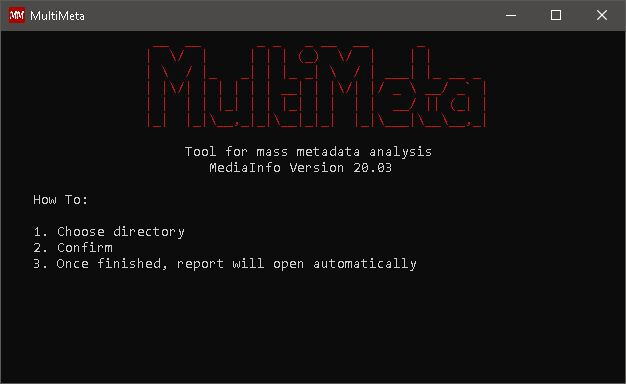
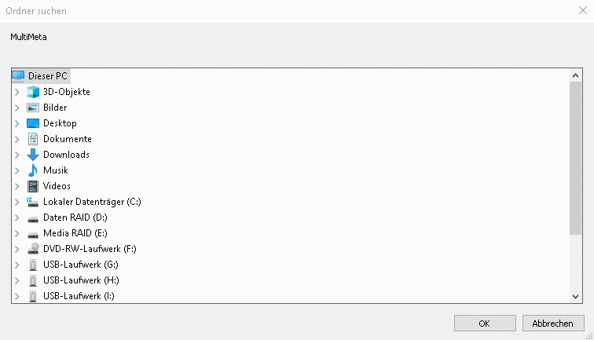

# MultiMeta

  

This projekt startet with the need to analyse the metadata of countless videofiles at my work. This process often included way more than 500 files per day.
The commandline version of [MediaInfo](https://mediaarea.net/en/MediaInfo) is used to do the analysing part. It is fast, customizable and has the possibility to redirect the output.

The computers we use on site are heavily restricted by our Administrators and are also part of an Office365 environment which forced the use of many workarounds to not trigger the [UAC](https://en.wikipedia.org/wiki/User_Account_Control). The biggest restriction was not beeing able to install anything. Which brought up the interesting challenge of using Batch only.

## Table of contents

   * [Readme.md](README.md)
   * [Table of contents](https://github.com/Knafi/MultiMeta#table-of-contents)
   * [What is MultiMeta](https://github.com/Knafi/MultiMeta#what-is-multimeta)
   * [Installation](MultiMeta/Resources/Documentation/Installation.md)
   * [Usage](https://github.com/Knafi/MultiMeta#usage)
      * [Analysing]()
      * [Report]()
   * [Uninstall](MultiMeta/Resources/Documentation/uninstall.md)
   * [ToDo](https://github.com/Knafi/MultiMeta#todo)
   * [Useful Links](MultiMeta/Resources/Documentation/Useful_Links.md)
      * [MediaInfo CLI](MultiMeta/Resources/Documentation/MI_CLI_help.md)
      * [Office Data Connection](MultiMeta/Resources/Documentation/ODC.md)
   * [Credits](https://github.com/Knafi/MultiMeta#credits)
   * [License](LICENSE)

## What is MultiMeta?
MultiMeta provides a way to use the MediaInfo CLI version on multiple files. It is possible to recursively analyse against a whitelist of specified filetypes.  
For my purpose I needed only a few parameters:  
- Filename (with full path), 
- Filesize
- Duration
- Resolution
- FPS
- Scan-Type
- Format  

Once the analysing part is complete, a HTML page with the report will open in your default browser.
From here on you can print, print to PDF or open the report in Excel. 

## Usage

  

Start MultiMeta via desktop shortcut or by seaching for in the windows start menu. 
You a dialogue will open prompting you to choose a directory to analyse. After clicking okay the process will start.

## ToDo

- [ ] Update MediaInfo CLI to 20.08
- [ ] Add multiple choice for parameters to analyse
- [ ] Fix odc templatefile to work with older office versions
- [ ] ...

## Credits
I had to search the web alot as I am neither a developer nor a programmer.\
Give credit where credit is due.
  
**Metadata analysis:**  
This product uses [MediaInfo library](https://mediaarea.net/en/MediaInfo), Copyright (c) 2002-2020 [MediaArea.net SARL](info@mediaarea.net).  
- https://mediaarea.net/en/MediaInfo  
Jérôme Martinez and Team  
  
**Multiple Colors in Batch File:**  
- https://stackoverflow.com/a/38617204  
Jens A. Koch  
- https://github.com/MicrosoftDocs/Console-Docs/blob/master/docs/console-virtual-terminal-sequences.md  
miniksa, bitcrazed, DanielRosenwasser, GoBigorGoHome, VSC-Service-Account, craigloewenms, Vap0r1ze, zadjii-msft, mattwojo, JPRuskin  

**Folder Browser - dialog:**  
- https://stackoverflow.com/a/15885133  
rojo  
- https://docs.microsoft.com/en-us/dotnet/api/system.windows.forms.folderbrowserdialog?redirectedfrom=MSDN&view=netframework-4.8  
mairaw, VSC-Service-Account, TianqiZhang, yishengjin1413, dend, BillWagner, mkwhalen, jkotas, gewarren  

**Progress as window title:**  
- https://gist.github.com/Archigos/0e34219b4a8b82358bb0  
Archigos  

**Deletion of self and parent directory:**  
- https://stackoverflow.com/a/17180982  
BILL  

**Convertion from CSV to HTML table:**  
- https://www.computerhope.com/forum/index.php/topic,160315.msg961200.html#msg961200  
Hackoo  
